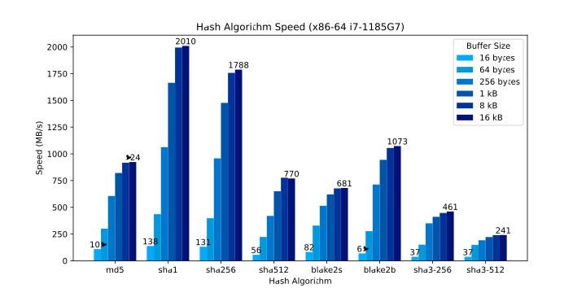
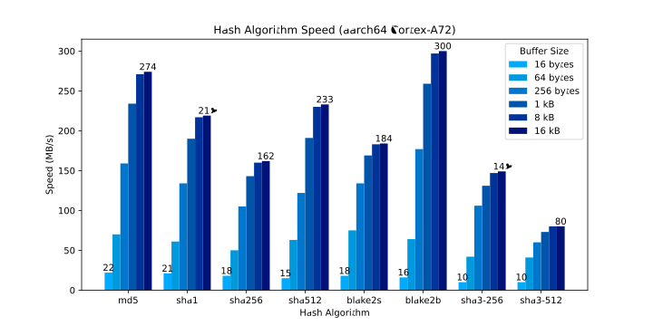

# Cryptographic Hash Algorithm Benchmarks

Companion repository to [this post][post] on my blog.

Scripts to benchmark the several cryptographic hash functions using the
[OpenSSL][] `speed` command and generate [SVGs][svg] of the results.

The hash functions are as follows:

* [MD5][md5]
* [SHA-1][sha1]
* [SHA-256][sha2]
* [SHA-512][sha2]
* [BLAKE2s][blake2]
* [BLAKE2b][blake2]
* [SHA3-256][sha3]
* [SHA3-512][sha3]

## Installation

You'll need [Bundler][] and [pipenv][] installed.

1. Download the [OpenSSL][] source code.
2. Compile [OpenSSL][] from source (`./Configure && make`).
3. Run `bundle install --without=dev` to install the [Ruby][]
   dependencies.
4. Run `pipenv sync` to install the [Python][] dependencies.
5. (Optional) Install [minify][].  `sudo apt install minify`.
   Instructions for other platforms are available
   [here][minify-install].

Example:

```sh
# install ruby dependencies
bundle install --without=dev

# install python dependencies
pipenv sync

# install minify (debian)
sudo apt install minify
```

## Usage

1. Set `LD_LIBRARY_PATH` to the [OpenSSL][] source directory.
2. Prepend `SSL_DIR/apps` to `PATH`.
3. **Verify** that you are using the version of [OpenSSL][] compiled
   in the installation instructions above using the `openssl version`
   command.
4. Run `bundle exec bin/bench.rb > results.json` to run the hash
   write the [JSON][]-formatted results to `./results.json`.
5. Run  `pipenv run bin/plot.py < ./results.json > results.svg`.
6. (Optional) Minify the [SVG][]: `minify results.svg > results.min.svg`.

Example:

```sh
# set LD_LIBRARY_PATH and PATH
SSL_DIR=$HOME/src/openssl-3.0.3
export LD_LIBRARY_PATH="$SSL_DIR" PATH="$SSL_DIR/apps:$PATH"

# run benchmarks, write results to results.json
bundle exec bin/bench.rb > results.json

# generate SVG
pipenv run bin/plot.py < results.json > results.svg

# write minified SVG to results.min.svg
minify results.svg > results.min.svg
```

Shorter version:

```sh
# set LD_LIBRARY_PATH and PATH
SSL_DIR=$HOME/src/openssl-3.0.3
export LD_LIBRARY_PATH="$SSL_DIR" PATH="$SSL_DIR/apps:$PATH"

# run benchmarks and write SVG to "results.min.svg"
bundle exec bin/bench.rb | \
  pipenv run bin/plot.py | \
  minify --type svg > results.min.svg
```

## Results

Example results:




## Miscellaneous

Repository contents:

* `bin/bench.rb`: Run benchmarks and write results as [JSON][] to
  standard output.
* `bin/plot.py`: Read [JSON][]-formatted benchmark results from standard
  input and write an unminified [SVG][] to standard output.
* `bin/config.yaml`: Configuration options for both scripts.
* `data/`: My benchmark results.

[openssl]: https://www.openssl.org/
  "Cryptography and TLS toolkit."
[md5]: https://en.wikipedia.org/wiki/MD5
  "MD5 cryptographic hash function (broken, don't use)."
[sha1]: https://en.wikipedia.org/wiki/SHA-1
  "SHA-1 cryptographic hash function (broken, don't use)."
[sha2]: https://en.wikipedia.org/wiki/SHA-2
  "SHA-2 cryptographic hash function family."
[blake2]: https://en.wikipedia.org/wiki/BLAKE_(hash_function)#BLAKE2
  "BLAKE2 cryptographic hash function family."
[sha3]: https://en.wikipedia.org/wiki/SHA-3
  "SHA-3 cryptographic hash function family."
[ruby]: https://www.ruby-lang.org/en/
  "Ruby programming language."
[bundler]: https://bundler.io/
  "Ruby dependency management tool."
[python]: https://www.ruby-lang.org/en/
  "Python programming language."
[pipenv]: https://github.com/pypa/pipenv
  "Python tool for managing dependencies and and virtual environment."
[minify]: https://github.com/tdewolff/minify
  "Go minification library with command-line interface."
[minify-install]: https://github.com/tdewolff/minify/tree/master/cmd/minify
  "Installation instructions for minify."
[json]: https://json.org/
  "JavaScript Object Notation"
[svg]: https://en.wikipedia.org/wiki/Scalable_Vector_Graphics
  "Scalable Vector Graphics"
[post]: https://pablotron.org/2022/06/10/hash-speeds/
  "OpenSSL Hash Benchmarks blog post"
